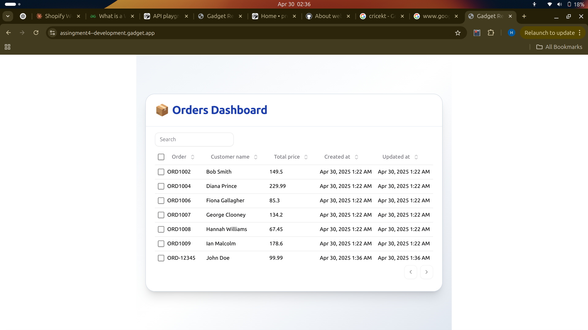

# Shopify WhatsApp Notification App

A Gadget.dev app that simulates Shopify order . The app receives webhook data, stores order information, and displays it in a simple frontend.

## Implementation

### Backend
- **Model**: Order (orderId, customerName, totalPrice)
- **Action**: receiveWebhook - processes incoming data and saves to database
- **API Endpoint**: Public endpoint accepting POST requests

### Frontend
- Simple table view displaying all orders
- Basic styling


## API Usage

```
POST [https://assingment4--development.gadget.app/api/orders]
{
  "orderId": "ORD-12345",
  "customerName": "John Doe",
  "totalPrice": 99.99
}
```


## Technical Notes
- Error handling for missing fields
- Field validation before database storage
- No actual Shopify or WhatsApp integration (simulation only)


## Future Enhancements
- Authentication for webhook endpoint
- Real WhatsApp integration via Twilio
- Advanced filtering and sorting
- Order statistics dashboard

Note: Please wait for the table to completely load, it may take a few seconds.


